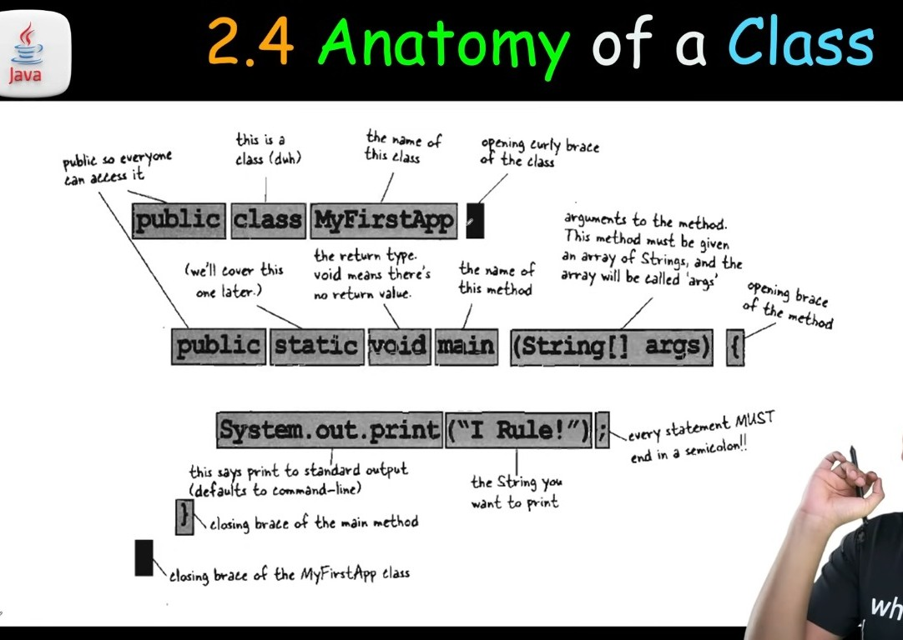
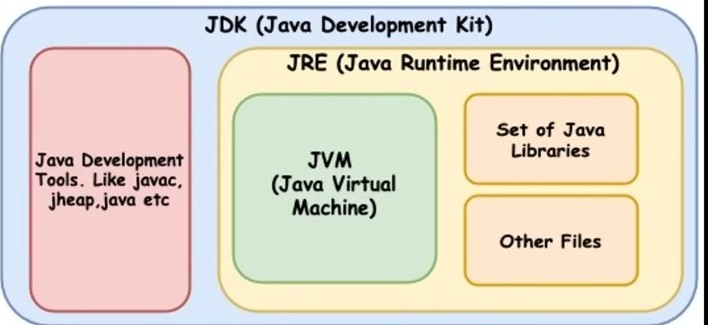

# JAVA 
- OBJECT ORIENTED PROGRAMMING LANGUAGE 

- HIGH LEVEL PROGRAMMING LANGUAGES
- HYBRID LANGUAGE 

  - **COMPILER BASED ==> HIGH LEVEL LANGIAGE TO LOW LEVEL LANGUAGE / MACHINE CODES [0 AND 1]** 
  - **INTERPRETER LANGUAGES ==> EXECUTION OF CODES LINE BY LINE**

- **CASE SENSITIVE LANGUAGE** 

- RICH APIS AND COMMUNICATIONS

- WIDE USUAGE [WEB-APPS , BACKEND, MOBILE APPS, ENTERPRISE SOFTWARES]

- DEVELOPED WITH VISION OF BACKWARD COMPATIBILITY [NEW VERSION CAN EASILY RUN THE OLD CODES]

- DEVELOPED WITH VISION OF FORWARD COMPATIBILITY [PREVIOUS VERSION OF CODES CAN BE EASILY RUN IN THE NEW VERSIONS]

- **JAVA SUPPORTS MAINLY BACKWARD COMPATIBILITY RATHER THAN FORWARD COMPATIBILITY**

- JAVA IS BYTECODED SUPPORTED AND BYTECODE IS PLATFORM INDEPENDENT

## WHAT IS ALGORITHOMS
STEP BY STEP TO PROCEDURE TO SOLVES A PROBLEMS 

## SYNTAX
- STRUCTURE OF WORDS IN A SENTENCE 
- RULES OF THE LANGUAGE 
- FOR PROGRAMMING EXACT SYNTAX MUST BE FOLLOWED

## HISTORY OF JAVA
- DEVELOPED BY JAMES GOSLING AT SUN MICROSYSTEMS
- ORIGINALLY NAMED " OAK " LATER NMAED JAVA IN 1995

## HOW JAVA CHANGED THE INTERNET
- PORTABILITY WITH WRITE ONCE RUN ANYWHERE
- SECURITY BECAUSE BYTE CODES RUNS ON VIRTUAL ENVIRONMENTS **[JVM ==> JAVA VIRTUAL MACHINES]**

## JAVA BUZZWORDS
- JAVA AIS **ROBUST** DUE TO 
  - STRONG MEMORY MANAGMENTS 
  - EXCEPTION HANDLINGS
  - TYPE CHECKING MECHANISMS

- *MULTITHREADED*
  - MULTITHREADING IN PROGRAMMING LANGUAGE IS THE ABILITY TO A CPU EXECUTE MULTIPLE THREADS CONCURRENTLY ALLOWING MORE EFFICIENCY TO PROCESSING AND TASK MANAGEMENTS 

  - **THREAD => THREAD IS A LIGHTWEIGHT PROCESS THAT IS GENERATED BY THE CPU AS A EXECUTABLE PATH FOR EXECUTING/PERFORMING  A PARTICULAR TASK**
    - **SINGLE  THREAD => WHEN NO OF EXECUTABLE PATH  IS ONE**
    -  **MULTITHREAD => WHEN NO OF EXECUTABLE PATHS IS GREATER THAN ON**
- **ARCHITECTURE NEUTRAL**
  - JAVA IS  ARCHITECTURALLY NEUTRAL BECAUSE IT COMPILED CODES [BYTE-CODES] THAT CAN RUN ON ANY DEVICE WITH A **JVM[JAVA VIRTUAL MACHINE]** , REGARDED THE UNDERLYING HARDWARE ARCHITECTURES

- INTERPRETED AND HIGH PERFORMANCE 
  - JAVA COMBINES HIGH PERFORMANCE WITH INTERPRETABILITY 

- **DISTRIBUTED** 
  - JAV AIS INHERENTLY DISTRIBUTED , DESIGNED TO FACILIATE NETWORK BASED APPLICATIONS DEVELOPMENTS AND INTERACTIONS , SEAMLESSLY INTEGRATING WITH INTERNET PROTOCOLS AND REMOTE METHOD INVOCATIONS 

- **OBJECT ORIENTED PROGRAMMINGS**
  - CLASSS & OBJECTS
  - CONSTRUCTORS AND DESCTRUCTORS
  - ACCESS MODIFIERS AND TYPES
  - ABSTRACTIONS 
  - ENCAPSULATIONS
  - INHERITANCES AND TYPES
  - POLYMORPHISMS NAD TYPES

## COMPILATION AND RUNNINGS
- PROGRAMME.JAVA -> JAVA COMPLIER [JAVAC] -> PROGRAMME.CLASS [BYTECODE.CLASS FILE] -> JVM [JAVA] -> PROGRAMME [EXECUTABLE FILE]

## ANATOMY OF A CLASS 
- 

## FILE EXTENSIONS
- **.JAVA ==> SOURCE CODE**
- **.CLASS CONTAINS JAVA BYTECODE**

## JDK JVM JRE
- JDK => JAVA DEVELOPMENT KIT
- JVM => JAVA VECTOR MACHINES
- JRE => JAVA RUNTIME ENVIRONMENTS 
  - 

## NEEDS OF IDE [INTEGRATED DEVELOPMENTS ENVIRONMENTS]
- STREAMLINES DEVELOPMENTS
- INCREASE PRODUCTIVITY
- SIMPLIFIES COMPLEX TASKS
- OFFERS A UNIFIED WORKSPACE
- IDE FEATURES
  - CODE AUTOCOMPLETES
  - SYNTAX HIGHLIGHTING
  - VERSION CONTROL 
  - ERROR CHECKING 

